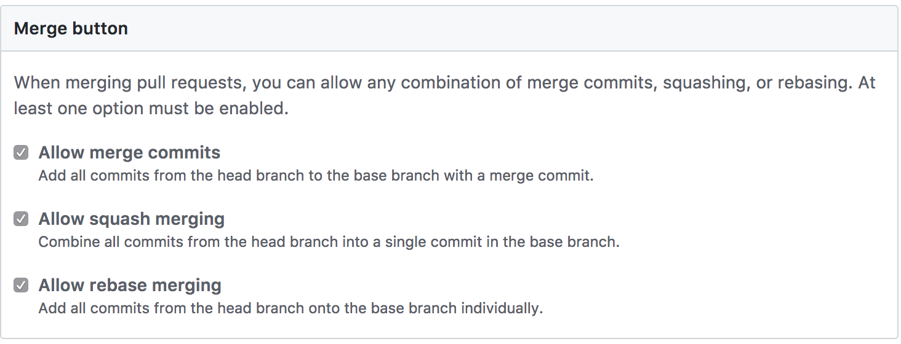

# WIP

# Git Rebase vs Merge: What, Why, How

Every so often the Git Rebase vs Merge debate rages. 

Each branch merge strategy has a time and place in the Software Design Lifecycle. 
Developers should understand what these operations are doing and how they effect the overall
branching strategy when determining when to use which method.

### What?

#### What is a Commit?
A **commit** is essentially a git patch file. It defines code to add or delete to the 
previous commit. It is represented by a unique string typically called a SHA or hash
(or both).

#### What is Rebase?
Rebasing is the process of replaying commits in the feature branch onto the branch being rebased
against. Each commit in the feature branch is replayed individually and any merge conflicts must
be resolved before the next commit can replayed. The results is a new set of commits that 
represent patches to be applied to the tip of the branch being rebased onto. Any commits on
the **remote** branch are obsolete and will need to updated using the `git push --force` command. 

#### What is Squash?
Squashing uses the `git rebase -i` command to combine a number of commits into fewer commits.
This is extremely useful to eliminate interim code changes that are no longer relevant
to the functionality being delivered. This is important to maintaining a concise git log,  

It is also recommended before rebasing onto another branch as it reduces the potential for 
obsolete merge conflicts. 

#### What is Merge?
Merging provides a mechanism to combine two commit histories while retaining the existing 
commits. This is accomplished using a **merge commit** which (magically?) retains information
about the branch being merged and information to resolve any merge conflicts that occurred
during the merge. 

### Why?
#### Effect on Git Log
Using `git rebase` effectively results in a cleaner git log by squashing out unnecessary commits.
In addition, `git merge --ff-only` is another tool for maintaining a clean git log when delivering 
code changes to the `develop` branch. This places the commits from the feature branch directly on
develop branch without any merge commits. This is only possible if the branch being merged has
been rebased with the tip of the `develop` branch and has not diverged.
 
Merging provides the ability to visually represent where code was merged from in the git log.
The `merge commit` provides an indication of when a particular set of specific commits were
delivered to a branch. This is powerful when combined with the GitFlow process as described below. 

#### Impact with GitFlow
**GitFlow** is a branch and release strategy whose value is increased with effective of use
of `rebase` and `merge`.

When code is delivered to the **develop** branch, using the combination of `git rebase -i` , 
`git rebase <branch>` and `git merge --ff-only` will ensure a linear, east to follow
 git history for the developers.
 
When code is delivered to the **master** branch, using `git merge --no-ff` will ensure a 
`merge commit` is always when **master** is updated. This allows the complete history of
releases, including hot-fixes, to be ascertained by examining the git log on the **master**
branch.

### How?
#### GitHub Merge Options 
**GitHub** has recently added functionality to help enforce this workflow. 

These options are applied when when **Pull Request** is merged onto the target branch. It is a convenient way
to integrate the described merging and branching strategy into any existing workflow. 